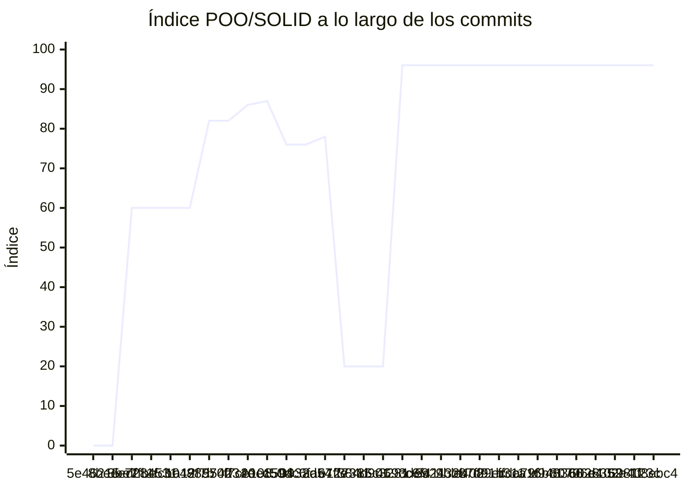

<!-- evaluacion:inicio -->
# Evaluación — Stark-Industries123/PROYECTO-FINAL-EUYIN

> Documento **generado automáticamente** por la cátedra de Programación II (RepoSense + análisis de calidad POO/SOLID). **No editar a mano**: se regenera en cada evaluación.
> Rama evaluada: `main`. Análisis **heurístico** (regex + métricas): es una criba para orientar la revisión, **no una nota**.
> Generado: 2026-11-20.

## 1. Veredicto

| Aspecto | Resultado |
|---|---|
| Índice de calidad POO/SOLID | **96/100** |
| Código (LOC) | 5,758 |
| Archivos de código | 112 |
| Clases (bien usadas) | 114 (84 OK) |
| Código dentro de clases (%POO) | 99% |
| Funciones fuera de clases | 0 |
| Duplicación lógica | 0.4% |
| Señales S/O/L/I/D | 3/0/0/0/2 |

> Este informe **describe** lo que el análisis midió con los criterios ya establecidos de la materia. No es una nota.

### Semáforo de aprobación

Criterios de `CRITERIOS-CALIDAD.md`. **Aprobar** se juega con el perfil `estandar`; **destacar**, con el `exigente` (meta de excelencia).

| Semáforo | Resultado |
|---|---|
| Aprobar (`estandar`) | **no cumple** — 3/4 |
| Destacar (`exigente`) | **no cumple** — 4/5 |

**Criterios para aprobar**

| Criterio | Requisito | Tu resultado | Cumple |
|---|---|---|---|
| Código dentro de clases (%POO) | ≥ 85% | 99% | sí |
| Duplicación lógica | ≤ 10% | 0.4% | sí |
| Funciones fuera de clases | ≤ 1 | 0 | sí |
| Señales POO/SOLID críticas | ninguna | Clase demasiado grande (SRP), Baja cohesión (LCOM), Acoplamiento alto (CBO) | no |

**Criterios para destacar**

| Criterio | Requisito | Tu resultado | Cumple |
|---|---|---|---|
| Código dentro de clases (%POO) | ≥ 95% | 99% | sí |
| Duplicación lógica | ≤ 5% | 0.4% | sí |
| Funciones fuera de clases | ≤ 1 | 0 | sí |
| Señales POO/SOLID críticas | ninguna | Clase demasiado grande (SRP), Baja cohesión (LCOM), Acoplamiento alto (CBO) | no |
| Índice de calidad POO/SOLID | ≥ 60 | 96/100 | sí |

### Cómo se calcula el %POO (y por qué no sube solo)

`%POO = líneas de lógica dentro de clases ÷ líneas de lógica totales`.

Se cuentan las líneas de **lógica y campos**; no cuentan `package`/`import`/`using`/anotaciones ni comentarios, Javadoc o docstrings. Es una **proporción**: si agregás código nuevo dentro de una clase, el numerador y el denominador crecen juntos y el porcentaje casi no cambia.

Sube cuando el código que hoy está **fuera** de clases pasa a ser método de una clase (o desaparece): funciones sueltas, `main`, constantes de módulo, scripts y lógica de archivos sueltos. También importa que ese trabajo esté **integrado en `main`**: la evaluación siempre mide `main`, así que lo que sigue en otra rama no se refleja todavía.

## 2. Autoría (RepoSense)

| Autor | Commits | Código (LOC) | Tests (LOC) | Docs (LOC) | Días activos | % del código |
|---|---:|---:|---:|---:|---:|---:|
| Eugenio Mosso | 22 | 4,515 | 2,034 | 2 | 12 | 100% |

> _El LOC de autoría lo calcula RepoSense sobre el historial y puede diferir del LOC de código del análisis de calidad (que mira solo el estado de `main`)._

## 3. Fallas detectadas

Reúne lo que el análisis marcó y lo que todavía falta para cada semáforo. Cuando la señal se puede asociar a archivos, se indican para orientar la revisión. No es una nota.

| Falla | Tu resultado | Requisito | Archivos |
|---|---|---|---|
| Señales POO/SOLID críticas | Clase demasiado grande (SRP), Baja cohesión (LCOM), Acoplamiento alto (CBO) | Aprobar: ninguna Destacar: ninguna | `app/src/main/kotlin/fisicas/motor/IntegradorCinematica3D.kt`, `app/src/main/kotlin/ui/GraficadorConsola.kt`, `app/src/main/kotlin/ui/VentanaSimulacion.kt` |
| Métodos/funciones largos o con muchos parámetros | **4** método(s)/función(es) largos o con muchos parámetros | Sin señales | `app/src/main/kotlin/fisicas/motor/MotorFisicaEuler2D.kt`, `app/src/main/kotlin/ui/VentanaSimulacion.kt`, `app/src/test/kotlin/ui/GraficadorConsolaMapeoTest.kt` |

## 4. Aspectos evaluados

Cada aspecto indica **qué mide**, **por qué importa** y **tu resultado**. Cuando el análisis reportó una señal, se agregan preguntas para **investigar la causa** (no hay recetas: entender el porqué es parte de la evaluación).

### 1. Índice de calidad POO/SOLID (indice)

- **Qué mide:** Un resumen numérico (0-100) que combina la riqueza de clases bien usadas con la penalización por señales POO/SOLID y duplicación, y luego aplica topes duros.
- **Por qué importa:** Ordena y prioriza la revisión: un índice bajo indica varias señales que conviene mirar juntas.
- **Tu resultado:** índice **96/100**

### 2. Duplicación lógica (DRY) (duplicacion) — sin señales

- **Qué mide:** Porcentaje de bloques de LÓGICA repetidos. Quedan fuera imports/includes, anotaciones, declaraciones de campos y comentarios/Javadoc/docstrings: esos bloques son boilerplate, no lógica.
- **Por qué importa:** Cada copia de lógica se mantiene por separado: un arreglo hay que repetirlo y los defectos se multiplican.
- **Tu resultado:** **0.4%** de duplicación lógica

### 3. Adopción de POO (% de código en clases) (poo) — sin señales

- **Qué mide:** Proporción de las **líneas de lógica** que viven dentro de una clase. Quedan fuera `package`/`import`/`using`/anotaciones y comentarios/Javadoc/docstrings: no son código que pueda estar dentro de una clase y, si contaran, el porcentaje quedaría topado por el boilerplate de cada archivo.
- **Por qué importa:** El diseño orientado a objetos es el eje de la materia: el comportamiento debería vivir como método de una clase.
- **Tu resultado:** **98.7%** del código dentro de clases
- **Cómo leerlo:** Es una **proporción**, no un acumulado: agregar código dentro de una clase no la sube por sí solo (numerador y denominador crecen juntos). Sube cuando el código que está **fuera** de clases (funciones sueltas, `main`, constantes de módulo, scripts) pasa a ser método de una clase o deja de existir. La medición se hace sobre `main`: el trabajo que todavía vive en otra rama no se refleja hasta que se integra.

### 4. Funciones fuera de clases (sueltas) — sin señales

- **Qué mide:** Funciones de nivel de módulo que no pertenecen a ninguna clase (en esta materia el comportamiento debe ser método de una clase).
- **Por qué importa:** Son la forma más directa de código procedural en un proyecto que debería ser orientado a objetos.
- **Tu resultado:** **0** función(es) fuera de clases

### 5. Clase demasiado grande (SRP) (god) — con señales

- **Qué mide:** Clases con demasiadas líneas o métodos de LÓGICA. No cuentan los getters/setters triviales ni la cantidad de campos por sí sola.
- **Por qué importa:** Una clase que hace de todo cambia por muchos motivos y cuesta entenderla y probarla.
- **Tu resultado:** **2** clase(s) demasiado grande(s)
- **Para investigar la causa:**
    - ¿La clase creció por acumulación de responsabilidades?
    - ¿Qué partes de la clase se usan siempre juntas y cuáles no?
    - ¿Se podría describir su responsabilidad en una sola frase?

### 6. Baja cohesión (LCOM) (cohesion) — con señales

- **Qué mide:** Métodos y campos de una clase que casi no se relacionan entre sí.
- **Por qué importa:** Una unidad que cambia por motivos distintos y comparte poca información suele esconder más de una responsabilidad.
- **Tu resultado:** **3** clase(s) con baja cohesión
- **Para investigar la causa:**
    - ¿Qué métodos de la clase no comparten estado con el resto?
    - ¿Cambian por motivos distintos según la tarea?
    - ¿Se pensó su responsabilidad antes de escribirla, o se fue agregando?

### 7. Complejidad alta (complejidad) — sin señales

- **Qué mide:** Complejidad ciclomática: cantidad de caminos posibles dentro de un método o función (condicionales, bucles, casos).
- **Por qué importa:** Muchos caminos = difícil de seguir y de probar; suelen esconderse casos sin cubrir.
- **Tu resultado:** **0** método(s)/función(es) con complejidad alta

### 8. Métodos/funciones largos o con muchos parámetros (tamano) — con señales

- **Qué mide:** Tamaño de los métodos/funciones y cantidad de parámetros.
- **Por qué importa:** Una función que hace varias cosas cuesta leerla, nombrarla y reutilizarla.
- **Tu resultado:** **4** método(s)/función(es) largos o con muchos parámetros
- **Para investigar la causa:**
    - ¿La función creció por acumulación de pasos?
    - ¿Agrupa operaciones que podrían describirse por separado?
    - ¿Los parámetros representan una misma idea (un objeto) o cosas sueltas?

### 9. Acoplamiento alto (CBO) (acoplamiento) — con señales

- **Qué mide:** Cuánto depende una clase de otros tipos del proyecto. No cuentan los tipos de la plataforma (biblioteca estándar, DOM, motor Godot) ni los métodos/propiedades propias.
- **Por qué importa:** Piezas muy enlazadas hacen que un cambio se propague y que sea difícil reemplazar partes.
- **Tu resultado:** **2** clase(s) muy acoplada(s)
- **Para investigar la causa:**
    - ¿La clase conoce detalles internos de muchas otras?
    - ¿Se puede cambiar una parte sin tocar las demás?
    - ¿Los colaboradores llegan como parámetros o se crean por dentro?

### 10. Herencia profunda (DIT) (herencia) — sin señales

- **Qué mide:** Profundidad de la cadena de herencia de una clase.
- **Por qué importa:** Jerarquías muy profundas vuelven difícil saber de dónde viene cada comportamiento.
- **Tu resultado:** **0** clase(s) con herencia profunda

### 11. Switch sobre tipos (OCP) (ocp) — sin señales

- **Qué mide:** Cadenas de dispatch por tipo (`else if ... is` / `else if ... instanceof`, `switch` sobre tipo o `typeof`). Un `is Tipo variable` aislado (pattern matching / cast seguro) NO cuenta como switch.
- **Por qué importa:** Cada tipo nuevo obliga a tocar varios lugares, en vez de extender con una implementación nueva.
- **Tu resultado:** **0** clase(s) con switch sobre tipos

### 12. Interfaz con demasiados métodos (ISP) (isp) — sin señales

- **Qué mide:** Interfaces o clases abstractas con muchos métodos declarados.
- **Por qué importa:** Obliga a implementar operaciones que no se usan y acopla a los clientes a métodos que no necesitan.
- **Tu resultado:** **0** interfaz(es) con demasiados métodos

### 13. Override vacío o 'no implementado' (LSP) (lsp) — sin señales

- **Qué mide:** Métodos sobrescritos que quedan vacíos o lanzan 'no implementado'.
- **Por qué importa:** Suele indicar que la jerarquía no representa bien el problema y rompe la sustitución entre clases.
- **Tu resultado:** **0** override(s) vacío(s) o 'no implementado'

### 14. Clase sin métodos (solo datos) (data) — sin señales

- **Qué mide:** Clases que solo acumulan campos y no tienen comportamiento.
- **Por qué importa:** Separar datos de comportamiento reparte por el proyecto la lógica que debería estar cerca de esos datos.
- **Tu resultado:** **0** clase(s) sin métodos (solo datos)

### 15. Campos mutables públicos (encapsulación) (encapsulacion) — sin señales

- **Qué mide:** Clases que exponen estado **modificable** desde afuera. No cuentan constantes (`static final`, `const`), campos `final`/`readonly`, propiedades `val` de Kotlin ni propiedades con `private set`.
- **Por qué importa:** Expone el estado interno y hace que cualquier cambio dependa de quién lo modifica desde afuera.
- **Tu resultado:** **0** clase(s) con campos mutables públicos

### 16. Clase solo con métodos estáticos (utilitaria) (static) — sin señales

- **Qué mide:** Clases donde todos los métodos son estáticos.
- **Por qué importa:** Es comportamiento procedural disfrazado de clase: no se instancia ni participa del modelo de objetos.
- **Tu resultado:** **0** clase(s) solo con métodos estáticos

### Archivos donde se originan las señales

> Se listan **11** hallazgo(s) localizados en **5** archivo(s). La columna `Línea` es la línea del archivo donde el análisis detectó la señal; `—` indica una señal de nivel repositorio (sin archivo propio).

| Aspecto | Archivo | Línea | Hallazgo |
|---|---|---:|---|
| Clase demasiado grande (SRP) | `app/src/main/kotlin/ui/VentanaSimulacion.kt` | 62 | clase 'VentanaSimulacion' grande (LOC lógico=353, métodos=36, campos=28) |
| Clase demasiado grande (SRP) | `app/src/main/kotlin/ui/VentanaSimulacion.kt` | 643 | clase 'PanelTrayectoria' grande (LOC lógico=210, métodos=24, campos=22) |
| Baja cohesión (LCOM) | `app/src/main/kotlin/ui/GraficadorConsola.kt` | 29 | clase 'GraficadorConsola' con baja cohesión (31%) |
| Baja cohesión (LCOM) | `app/src/main/kotlin/ui/VentanaSimulacion.kt` | 62 | clase 'VentanaSimulacion' con baja cohesión (23%) |
| Baja cohesión (LCOM) | `app/src/main/kotlin/ui/VentanaSimulacion.kt` | 643 | clase 'PanelTrayectoria' con baja cohesión (19%) |
| Métodos/funciones largos o con muchos parámetros | `app/src/main/kotlin/fisicas/motor/MotorFisicaEuler2D.kt` | 23 | método 'MotorFisicaEuler2D.integrarPaso' con 5 parámetros |
| Métodos/funciones largos o con muchos parámetros | `app/src/main/kotlin/fisicas/motor/MotorFisicaEuler2D.kt` | 54 | método 'MotorFisicaEuler2D.avanzarEstado' con 6 parámetros |
| Métodos/funciones largos o con muchos parámetros | `app/src/main/kotlin/ui/VentanaSimulacion.kt` | 303 | método 'VentanaSimulacion.ingresarDatos' con 5 parámetros |
| Métodos/funciones largos o con muchos parámetros | `app/src/test/kotlin/ui/GraficadorConsolaMapeoTest.kt` | 54 | método 'GraficadorConsolaMapeoTest.testDesplazamientoNegativoMuestraLineaVerticalOrigenYRebotesHaciaAtras' de 38 líneas |
| Acoplamiento alto (CBO) | `app/src/main/kotlin/fisicas/motor/IntegradorCinematica3D.kt` | 18 | clase 'IntegradorCinematica3D' muy acoplada (CBO=8) |
| Acoplamiento alto (CBO) | `app/src/main/kotlin/ui/VentanaSimulacion.kt` | 62 | clase 'VentanaSimulacion' muy acoplada (CBO=12) |

### Desglose de la columna S (SRP)

> La columna **S** no es un puntaje: cuenta **señales** de SRP. Aquí suma **3** entrada(s) sobre **3** clase(s) distinta(s).

| Señal | Entradas | Regla (perfil exigente) |
|---|---:|---|
| Clase grande | 2 | ≥ 200 LOC lógico, o ≥ 15 métodos con lógica y ≥ 100 LOC lógico. No cuentan getters/setters. |
| Cohesión baja | 1 | < 50 % de los pares de métodos comparten algún campo (con ≥ 4 métodos con lógica y ≥ 3 campos). |

**Clases grandes (2)**

- `VentanaSimulacion`: clase grande (LOC lógico=353, métodos=36, campos=28)
- `PanelTrayectoria`: clase grande (LOC lógico=210, métodos=24, campos=22)

**Clases con baja cohesión (1)**

- `GraficadorConsola`: cohesión baja (31% de pares comparten campos)

> Los **4** hallazgo(s) de métodos largos o con muchos parámetros se listan en «Métodos/funciones largos o con muchos parámetros» y **no suman** a la columna S.

> El análisis no excluye tests: una clase de test que supere los umbrales también suma.

## 5. Evolución por commit

Métricas calculadas sobre el estado de `main` en **cada commit** (30 commits con trabajo), del primero al último. La calidad usa el perfil `exigente`; el aporte de código lo mide RepoSense. El índice puede **bajar** al crecer el proyecto: se acumulan señales.

```mermaid
xychart-beta
    title "Índice POO/SOLID a lo largo de los commits"
    x-axis ["5e46215", "8beeedf", "3be7fbe", "7284531", "1fcb049", "1a12f7b", "88970ff", "554234e", "f7ce108", "20e1594", "c50dc6f", "0933d54", "aa67ffe", "e127311", "384d901", "86c3281", "4693de9", "cc6f411", "5c2432b", "9bb87f2", "e4089ec", "d91b311", "ffda79f", "ca16bc1", "c948366", "80706d4", "6026352", "e102a40", "698123c", "1f8ebc4"]
    y-axis "Índice" 0 --> 100
    line [0, 0, 60, 60, 60, 60, 82, 82, 86, 87, 76, 76, 78, 20, 20, 20, 96, 96, 96, 96, 96, 96, 96, 96, 96, 96, 96, 96, 96, 96]
```

| # | Fecha | Commit | Autor | LOC | Índice | %POO | Duplic. | Sueltas |
|---|---|---|---|---:|---:|---:|---:|---:|
| 1 | 2026-08-21 | `5e46215` | euge | 0 | 0 | 0% | 0.0% | 0 |
| 2 | 2026-08-24 | `8beeedf` | dqmdz-etec | 0 | 0 | 0% | 0.0% | 0 |
| 3 | 2026-09-28 | `3be7fbe` | euyin | 105 | 60 | 50% | 0.0% | 0 |
| 4 | 2026-09-28 | `7284531` | euyin | 174 | 60 | 31% | 0.0% | 2 |
| 5 | 2026-10-09 | `1fcb049` | euyin | 231 | 60 | 41% | 0.0% | 2 |
| 6 | 2026-10-09 | `1a12f7b` | euyin | 430 | 60 | 68% | 0.0% | 2 |
| 7 | 2026-10-09 | `88970ff` | euyin | 393 | 82 | 79% | 0.0% | 0 |
| 8 | 2026-10-16 | `554234e` | euyin | 445 | 82 | 80% | 0.0% | 0 |
| 9 | 2026-10-16 | `f7ce108` | euyin | 718 | 86 | 87% | 0.0% | 0 |
| 10 | 2026-10-19 | `20e1594` | euyin | 1,845 | 87 | 97% | 1.3% | 0 |
| 11 | 2026-10-30 | `c50dc6f` | euyin | 4,652 | 76 | 98% | 5.9% | 0 |
| 12 | 2026-10-30 | `0933d54` | euyin | 4,795 | 76 | 98% | 5.7% | 0 |
| 13 | 2026-10-30 | `aa67ffe` | euyin | 5,217 | 78 | 99% | 5.3% | 0 |
| 14 | 2026-11-06 | `e127311` | euyin | 5,118 | 20 | 95% | 1.0% | 10 |
| 15 | 2026-11-06 | `384d901` | euyin | 5,129 | 20 | 95% | 1.0% | 10 |
| 16 | 2026-11-06 | `86c3281` | euyin | 5,379 | 20 | 95% | 1.0% | 10 |
| 17 | 2026-11-06 | `4693de9` | euyin | 5,667 | 96 | 99% | 0.4% | 0 |
| 18 | 2026-11-07 | `cc6f411` | dqmdz-etec | 5,667 | 96 | 99% | 0.4% | 0 |
| 19 | 2026-11-07 | `5c2432b` | dqmdz-etec | 5,667 | 96 | 99% | 0.4% | 0 |
| 20 | 2026-11-07 | `9bb87f2` | dqmdz-etec | 5,667 | 96 | 99% | 0.4% | 0 |
| 21 | 2026-11-07 | `e4089ec` | dqmdz-etec | 5,667 | 96 | 99% | 0.4% | 0 |
| 22 | 2026-11-13 | `d91b311` | dqmdz-etec | 5,667 | 96 | 99% | 0.4% | 0 |
| 23 | 2026-11-14 | `ffda79f` | dqmdz-etec | 5,667 | 96 | 99% | 0.4% | 0 |
| 24 | 2026-11-16 | `ca16bc1` | dqmdz-etec | 5,667 | 96 | 99% | 0.4% | 0 |
| 25 | 2026-11-16 | `c948366` | euyin | 5,731 | 96 | 99% | 0.4% | 0 |
| 26 | 2026-11-16 | `80706d4` | euyin | 5,758 | 96 | 99% | 0.4% | 0 |
| 27 | 2026-11-17 | `6026352` | dqmdz-etec | 5,758 | 96 | 99% | 0.4% | 0 |
| 28 | 2026-11-20 | `e102a40` | dqmdz-etec | 5,758 | 96 | 99% | 0.4% | 0 |
| 29 | 2026-11-20 | `698123c` | dqmdz-etec | 5,758 | 96 | 99% | 0.4% | 0 |
| 30 | 2026-11-20 | `1f8ebc4` | dqmdz-etec | 5,758 | 96 | 99% | 0.4% | 0 |

---
_Informe generado por la cátedra. Los criterios y umbrales de medición corresponden al perfil `exigente` de `calidad.py`; el semáforo de aprobación, a `CRITERIOS-CALIDAD.md` (ver `README.md`). Ante dudas, revisá el archivo señalado._
<!-- evaluacion:fin -->
